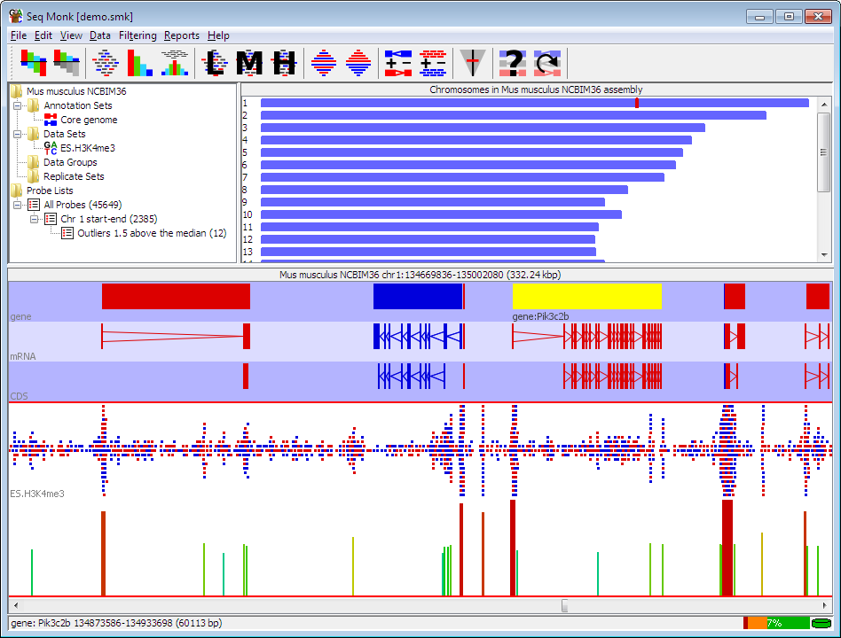

# Visualising Alignments and Assemblies

## --from SAM files to SeqMonk

## The SAM/BAM file format

The Sequence Alignment Map (SAM) file format is the standard format for storing output from mapping next-generation sequence reads to a genome, transcriptome, or other reference. They are most often in the compressed version, called BAM (binary alignment map), because their size can be very large. These files store a lot of information about each read, as it relates to the reference. 

**[This link has a good basic description](http://www.metagenomics.wiki/tools/samtools/bam-sam-file-format)**

Details of all standard and optional fields are found in this **[PDF](http://samtools.github.io/hts-specs/SAMv1.pdf)**

There are two main components of a SAM file: the first part is the header section, which can include information about the file parameters ('@HD', e.g. format, and sorting order of reads), the reference sequences ('@SQ', sequence name and length) and the sample, or Read Group ('@RQ', e.g. ID, barcode, platform). SAM files can vary a lot, and not all of them will have every field. There are only a few fields required for each. See the PDF link for minimal requirements. 

The most useful information in a SAM file is in the alignment section, which has 11 mandatory fields and many many optional fields (you can even add your own fields). This section is essentially a giant table (tab-delimited), with each field as column and each read is a row. As an example, here are the first six columns:

QNAME | FLAG | RNAME | POS | MAPQ | CIGAR |
------|------|-------|-----|------|-------|
query name | code | reference | ref start | mapping qual | indel info |

### Manipulating SAM/BAM files

Most of your interaction with SAM/BAM files will be to manipulate them, for example, sorting, filtering or extracting information from them based on one or several of these fields. There are several tools available for these, here are links and usage examples for two of the most popular:

**[samtools](http://www.htslib.org/doc/samtools.html)**

samtools usage examples

**[picard tools](https://broadinstitute.github.io/picard/)**

[picard tools usage examples](hackyhour/examples/picard_examples.md)

  
## [SeqMonk - Visualising Alignments](https://www.bioinformatics.babraham.ac.uk/projects/seqmonk/)

SeqMonk is a tool for visualising and analysing high throughput sequence data. It can import genome files, mapping files (BAM), annotation files (gff, gtf), as well as other types of data formats. In this session we provide just a brief overview of its capabilities.

  

